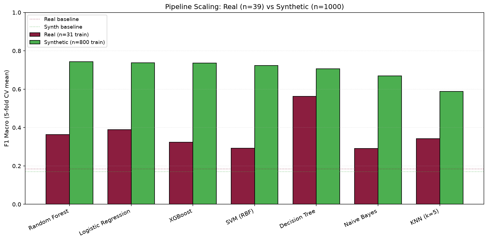

# 🧠 Machine Learning-Based Prediction of Academic Stress Among Undergraduate Students in Nepal

[](https://www.python.org/)
[](https://scikit-learn.org/)
[](https://xgboost.readthedocs.io/)
[](https://shap.readthedocs.io/)
[](https://streamlit.io/)
[](https://sqlite.org/)
[](#-project-status)

> **BCA Final-Year Project | Tribhuvan University, Nepal**

A survey-based machine learning research project investigating whether demographic, academic, lifestyle, and psychosocial factors can be used to predict **academic stress levels among undergraduate students in Nepal**.

The system classifies responses into **Low, Moderate, and High** stress levels and includes data analysis, machine learning, SHAP explainability, error analysis, a Streamlit research prototype, and a synthetic-data pipeline validation experiment.

> ⚠️ **Research Note:** The current genuine dataset contains only **39 responses**. Therefore, the real-data model is a **research prototype** and should not be considered a validated or clinically reliable stress-assessment system.

---

## 🎯 Objectives

* Analyze academic stress among undergraduate students.
* Construct a stress score from 10 survey questions.
* Categorize students into **Low / Moderate / High** stress levels.
* Perform data cleaning, EDA, and feature engineering.
* Compare multiple machine learning algorithms.
* Evaluate model performance using cross-validation and held-out testing.
* Investigate predictions using **SHAP**.
* Perform error analysis.
* Validate the ML pipeline using a larger synthetic dataset.
* Develop an interactive Streamlit research prototype.
* Support future research through anonymous response collection.

---

## 🔬 Research Principle

> **The data determines which features matter — not the researcher.**

The project does not assume that a particular demographic, academic, lifestyle, or psychosocial factor causes academic stress.

Model results are treated as exploratory evidence and require validation using a sufficiently large and representative real-world dataset.

---

## 📊 Dataset

### Real Survey Dataset

The real dataset was collected using the **Academic Stress Survey for Undergraduate Students**.

| Property             |                         Value |
| -------------------- | ----------------------------: |
| Genuine responses    |                        **39** |
| Cleaned observations |                        **39** |
| Cleaned variables    |                        **32** |
| Final ML features    |                        **37** |
| Target               |         Low / Moderate / High |
| Collection method    |              Anonymous survey |
| Planned dataset      | **300–500 genuine responses** |

### Main Feature Groups

* 👤 **Demographics:** age, gender, university, program, year, CGPA
* 📚 **Academic:** study hours, attendance, assignment stress, exams
* 🛌 **Lifestyle:** sleep, social media, physical activity, part-time job, screen time
* 🧠 **Psychosocial:** financial stress, social support, career stress, academic satisfaction and performance
* 📋 **Stress assessment:** 10 questions using a 1–5 frequency scale

Four positively worded stress questions are reverse-scored:

```text
stress_q4
stress_q5
stress_q7
stress_q8

reverse_score = 6 - original_score
```

---

## 🔄 Research Workflow

```text
Survey Data
    ↓
Data Understanding
    ↓
Data Cleaning
    ↓
Exploratory Data Analysis
    ↓
Stress Score Construction
    ↓
Low / Moderate / High Target
    ↓
Feature Engineering
    ↓
Model Training
    ↓
Cross-Validation + Test Evaluation
    ↓
SHAP Explainability
    ↓
Error Analysis
    ↓
Synthetic Pipeline Validation
    ↓
Streamlit Research Prototype
    ↓
Larger Genuine Data Collection
```

---

## 🤖 Machine Learning

The project compares:

* Decision Tree
* Logistic Regression
* Random Forest
* K-Nearest Neighbors
* XGBoost
* Support Vector Machine
* Naive Bayes
* Dummy Classifier baseline

### Real Data Results — n=39

| Model               |       CV Accuracy |       CV Macro F1 |
| ------------------- | ----------------: | ----------------: |
| **Decision Tree**   | **0.605 ± 0.231** | **0.562 ± 0.262** |
| Logistic Regression |     0.414 ± 0.146 |     0.389 ± 0.161 |
| Random Forest       |     0.410 ± 0.185 |     0.364 ± 0.197 |
| KNN                 |     0.381 ± 0.142 |     0.342 ± 0.163 |
| XGBoost             |     0.381 ± 0.142 |     0.323 ± 0.159 |
| SVM                 |     0.376 ± 0.209 |     0.292 ± 0.223 |
| Naive Bayes         |     0.286 ± 0.181 |     0.291 ± 0.181 |

Held-out test performance:

```text
Test Accuracy : 0.250
Test Macro F1 : 0.267
Baseline      : 0.386
```

The difference between cross-validation and held-out testing indicates substantial uncertainty and possible overfitting in the current small dataset.

---

## 🧪 Synthetic Pipeline Validation

A separate **1,000-row synthetic dataset** was used to examine how the existing ML pipeline behaves with a substantially larger sample.

> ⚠️ **Synthetic data is not real student data and is not used as evidence about academic stress among students in Nepal.**

| Property               |                        Value |
| ---------------------- | ---------------------------: |
| Dataset size           |               **1,000 rows** |
| Training samples       |                      **800** |
| Purpose                |  Pipeline/scaling validation |
| Source                 | LLM-generated synthetic data |
| Real research evidence |                       **No** |

### 5-Fold CV — Macro F1

| Model               |      Real | Synthetic | Difference |
| ------------------- | --------: | --------: | ---------: |
| Random Forest       |     0.364 | **0.744** |     +0.380 |
| Logistic Regression |     0.389 | **0.737** |     +0.348 |
| XGBoost             |     0.323 | **0.736** |     +0.413 |
| SVM                 |     0.292 | **0.724** |     +0.432 |
| Decision Tree       |     0.562 | **0.707** |     +0.145 |
| Naive Bayes         |     0.291 | **0.669** |     +0.378 |
| KNN                 |     0.342 | **0.588** |     +0.246 |
| Baseline            |     0.184 |     0.170 |          — |
| **Mean**            | **0.366** | **0.701** | **+0.335** |



### Interpretation

The experiment demonstrates that the same processing and modeling pipeline can be executed on a much larger dataset and produces more stable model estimates under the synthetic data conditions.

However, because the synthetic observations were generated rather than collected from students, these results **cannot be interpreted as expected real-world performance**.

The experiment therefore supports the decision to collect a substantially larger **genuine dataset** before drawing conclusions from the model.

---

## 🧠 Explainable AI

The project uses **SHAP TreeExplainer** to investigate model predictions.

Generated outputs include:

```text
figures/
├── shap_importance.png
├── shap_beeswarm_*.png
├── shap_waterfall_*.png
├── confusion_matrix_test.png
├── cv_vs_test.png
└── real_vs_synthetic_comparison.png
```

SHAP results from the current real dataset are treated as **exploratory** because of the small sample size.

---

## 🌐 Streamlit Research Prototype

The project includes an interactive Streamlit application.

### Features

* Interactive survey form
* Low / Moderate / High prediction
* Stress-level visualization
* Personalized suggestions
* Feature-based recommendations
* Research limitation warnings
* Optional anonymous research contribution
* SQLite response storage

```text
app/
├── app.py
├── utils.py
├── style.py
├── db.py
├── pages/
└── collected_data/
    └── responses.db
```

> ⚠️ The application is a research prototype and is **not a medical or psychological diagnostic tool**.

---

## 📁 Project Structure

```text
academic-stress-prediction-ml/
│
├── app/
│   ├── app.py
│   ├── utils.py
│   ├── style.py
│   ├── db.py
│   ├── pages/
│   └── collected_data/
│
├── data/
│   ├── raw/
│   ├── processed/
│   └── synthetic/
│       ├── README.md
│       ├── student_stress_synthetic_1000.csv
│       └── processed/
│
├── notebooks/
│   ├── 01_data_understanding.ipynb
│   ├── 02_data_cleaning.ipynb
│   ├── 03_exploratory_data_analysis.ipynb
│   ├── 04_feature_engineering.ipynb
│   ├── 05_model_training.ipynb
│   ├── 06_model_evaluation.ipynb
│   ├── 07_explainability_shap.ipynb
│   └── 08_error_analysis.ipynb
│
├── notebooks_synthetic/
│   ├── 01_synth_data_understanding.ipynb
│   ├── 02_synth_cleaning_and_target.ipynb
│   ├── 03_synth_feature_engineering.ipynb
│   ├── 04_synth_model_training.ipynb
│   └── 05_real_vs_synthetic_comparison.ipynb
│
├── models/
├── reports/
├── figures/
├── requirements.txt
└── README.md
```

---

## 🛠️ Tech Stack

| Category         | Technology               |
| ---------------- | ------------------------ |
| Language         | Python 3.12              |
| Environment      | uv + virtual environment |
| Data Processing  | pandas, NumPy            |
| Visualization    | Matplotlib, Seaborn      |
| Machine Learning | scikit-learn, XGBoost    |
| Explainable AI   | SHAP                     |
| Web Application  | Streamlit                |
| Database         | SQLite                   |
| Notebooks        | Jupyter                  |
| IDE              | VS Code                  |
| Version Control  | Git + GitHub             |

---

## 🚀 Reproducibility

### Clone

```bash
git clone https://github.com/iamsaroj2058/Academic-stress-prediction-ml.git
cd Academic-stress-prediction-ml
```

### Create Environment

```bash
uv venv ml --python 3.12
```

Linux/macOS:

```bash
source ml/bin/activate
```

Windows:

```powershell
ml\Scripts\activate
```

### Install Dependencies

```bash
uv pip install -r requirements.txt
```

### Run Real-Data Notebooks

```text
01 → 02 → 03 → 04 → 05 → 06 → 07 → 08
```

### Run Synthetic Validation

```text
notebooks_synthetic/
01 → 02 → 03 → 04 → 05
```

### Run Streamlit

```bash
streamlit run app/app.py
```

---

## 🚧 Project Status

| Task                                        | Status          |
| ------------------------------------------- | --------------- |
| Literature review                           | ✅ Completed     |
| Proposal defense                            | ✅ Completed     |
| Questionnaire design                        | ✅ Completed     |
| Initial genuine data collection             | ✅ Completed     |
| Data cleaning                               | ✅ Completed     |
| EDA                                         | ✅ Completed     |
| Stress-target construction                  | ✅ Completed     |
| Feature engineering                         | ✅ Completed     |
| Model training                              | ✅ Completed     |
| Model evaluation                            | ✅ Completed     |
| SHAP explainability                         | ✅ Completed     |
| Error analysis                              | ✅ Completed     |
| Streamlit prototype                         | ✅ Implemented   |
| Personalized suggestions                    | ✅ Completed     |
| SQLite response storage                     | ✅ Completed     |
| **Synthetic pipeline validation (n=1,000)** | ✅ **Completed** |
| Larger genuine data collection              | 🔄 Ongoing      |
| Research paper                              | ⏳ Planned       |
| Public deployment                           | ⏳ Planned       |

---

## ⚠️ Limitations

* The genuine dataset currently contains only **39 responses**.
* There are **37 ML features**, giving a high feature-to-sample ratio.
* The held-out test set contains only **8 observations**.
* Cross-validation and test performance differ substantially.
* Survey responses are self-reported.
* The current sample is not representative of Nepal's undergraduate population.
* No external validation has been performed.
* SHAP explanations may be unstable at the current sample size.
* The synthetic dataset is generated data and cannot replace genuine observations.

> **The synthetic experiment is a pipeline-validation exercise, not evidence of real-world prediction performance.**

---

## 🔮 Future Work

1. Collect **300–500 genuine responses**.
2. Improve representation across universities, programs, regions, and academic years.
3. Re-run the complete ML pipeline on the larger genuine dataset.
4. Investigate feature selection and regularization.
5. Explore continuous stress-score regression.
6. Investigate feature interactions using genuine data.
7. Perform external validation.
8. Continue improving the Streamlit application.
9. Prepare the project for research-paper publication.

---

## 🔐 Ethical Considerations

* Participation is voluntary.
* Survey responses are intended to remain anonymous.
* Data are collected for academic/research purposes.
* Synthetic data is clearly separated from genuine survey data.
* The application does not provide medical or psychological diagnosis.
* Predictions should not be used for high-stakes decisions.
* Future data collection will follow appropriate consent and privacy practices.

---

## 👨‍💻 Author

**Saroj Lamichhane**

BCA (Bachelor of Computer Application) Final-Year Student
Tribhuvan University, Nepal

🔗 **GitHub:**
https://github.com/iamsaroj2058/Academic-stress-prediction-ml

---

## 📄 License

This project is intended for **academic and research use**.

The current model is a research prototype and must not be used for:

* Mental-health diagnosis
* Medical assessment
* Treatment decisions
* High-stakes decisions about students

---

### ⭐ Project Status

> **Research Prototype — Machine Learning + Explainable AI + Streamlit + Synthetic Pipeline Validation**

The project currently includes a complete initial ML workflow, SHAP explainability, error analysis, a Streamlit prototype, anonymous SQLite response collection, and a separate synthetic-data experiment for pipeline validation.

The next major research phase is **collecting and validating a larger genuine dataset** before making substantive conclusions about academic stress among undergraduate students in Nepal.
